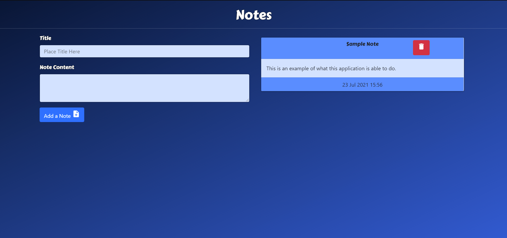

# Express.js Note Taker
## UofO Coding Bootcamp Homework for Week 11

### The function of this app is to be able to take notes and place them on the page using GET and POST requests. 

### A live example can be accessed [here.](https://homework-week-11.herokuapp.com/)
 

> **1920p width screen example.**   

> **Note: Appearance will change based on screen resolution.** 
